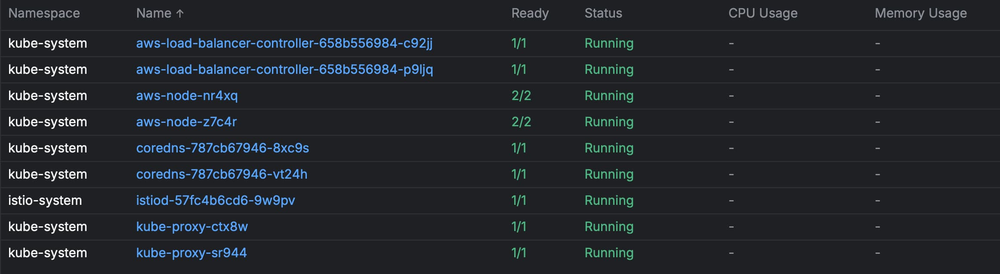

Working with Kubernetes opens a world of possibilities in a software project.
That's one of its biggest appeals to me as a developer.   And when building 
with distributed systems, one of the components that often gets added into
[on benefits of using a service mesh](https://istio.io/latest/about/service-mesh/),
head over there first. It
provides a nice overview of the benefits of using a mesh and how it fits 
into a Kubernetes deployment.  However, a limitation of a mesh is that it 
deals with east/west traffic.  That means service to service communication.  
But what about that critical north/south traffic? The kind that comes from 
users? Can my mesh provider in [Istio](https://istio.io/) play a role in 
this as well?  And how about pairing with with [Amazon's EKS](https://aws.amazon.com/eks/)?  Let's dive in!

## API Gateway

### What is an API Gateway

First off, let's define what an API Gateway is in the context of Kubernetes.

An API Gateway acts as a reverse proxy, routing external traffic to your
internal
services while providing essential features like authentication, rate limiting,
and
request transformation. In Kubernetes environments, it serves as the entry point
for all external traffic to your cluster's services.

Here are key reasons to implement an API Gateway in your Kubernetes setup:

- **Traffic Management**: Centralized control over routing, load balancing, and
  traffic splitting between different service versions
- **Security**: Consolidated authentication, authorization, and SSL/TLS
  termination
- **Monitoring**: Single point for collecting metrics, logging, and tracing data
- **API Composition**: Ability to aggregate multiple backend services into a
  single API
- **Rate Limiting**: Protection against abuse through request throttling
- **Protocol Translation**: Converting between different protocols (HTTP/1.1,
  HTTP/2,
  gRPC) as needed

## Istio Platform Install

All of these parts and pieces are nice, but how do they connect with AWS EKS 
and can I produce a working solution?  This walkthrough will be fairly 
in-depth so starting off with the cluster build.

### EKS Cluster

Throughout this build, I'm going to favor simplicity in terms of using 
`eksctl`, bare YAML for my Kubernetes resources, and shell scripts where 
needed.  This could be taken further with CDK, CloudFormation, Terraform, 
and other tools, but in examples that I tend to get the most out of, unless 
it's around that abstraction purpose, I like to see and do things vanilla.  

If you've cloned the repository // TODO INSERT REPOS and are working from it,
there's a file call `cluster-config.yaml`.  In that file, the cluster's 
configuration as well the node group requirements are defined.

```yaml
---
apiVersion: eksctl.io/v1alpha5
kind: ClusterConfig

metadata:
  name: sandbox
  region: us-west-2

managedNodeGroups:
  - name: mng-arm
    instanceType: m6g.large
    desiredCapacity: 2
```

When I run `eksctl create cluster -f cluster-config.yaml` everything gets 
going.  My VPC is configured, I get some subnets, a nodegroup for my cluster 
to work with as well as a functioning Kubernetes install.

### Installing Istio

I need to get Istio installed and into my cluster if I want to have it 
control my ingress traffic.  

  * Up first, download and unzip the [Istio binaries](https://istio.io/latest/docs/setup/getting-started/#download)
  * Run the `istioctl` command. 

```bash
  istioctl install \                                                                             
    --set profile=demo \
    --set values.gateways.istio-ingressgateway.type=NodePort
```

### AWS Gateway Controller

With Istio installed, I'm marching my cluster toward allowing ingress 
traffic through my Istio gateway.  The next step in the journey is to 
install an AWS Gateway Controller. This gateway controller will launch an 
AWS Load Balancer that can connect the outside world to my cluster.  I also 
get a couple of pods that make that connection more physical be bridging the 
cloud load balancer to a resource inside my cluster.  

I've created a shell script that encapsulates some of the tasks that are 
needed to get the controller in my cluster. 

```shell
# Associate IAM OIDC provider with the cluster
eksctl utils associate-iam-oidc-provider \
    --region us-west-2 \
    --cluster sandbox \
    --approve

# Download IAM policy for the AWS Load Balancer Controller
curl -o iam-policy.json https://raw.githubusercontent.com/kubernetes-sigs/aws-load-balancer-controller/v2.4.3/docs/install/iam_policy.json

# Create IAM policy using the downloaded policy document
aws iam create-policy \
    --policy-name AWSLoadBalancerControllerIAMPolicy \
    --policy-document file://iam-policy.json

# Create service account and attach IAM policy
eksctl create iamserviceaccount \
--cluster=sandbox \
--namespace=kube-system \
--name=aws-load-balancer-controller \
--attach-policy-arn=arn:aws:iam::252703795646:policy/AWSLoadBalancerControllerIAMPolicy \
--override-existing-serviceaccounts \
--region us-west-2 \
--approve

# Add AWS EKS Helm repository
helm repo add eks https://aws.github.io/x-charts

# Apply AWS Load Balancer Controller CRDs 
kubectl apply -k "github.com/aws/eks-charts/stable/aws-load-balancer-controller/crds?ref=master"

# Install AWS Load Balancer Controller using Helm
helm install aws-load-balancer-controller eks/aws-load-balancer-controller -n kube-system --set clusterName=sandbox --set serviceAccount.create=false --set serviceAccount.name=aws-load-balancer-controller
```

Running the `gateway_controller.sh` script is as follows:

```bash
chmod 755 gateway-controller.sh
./gateway-controller.sh
```

A glimpse into the new cluster with Istio and the gateway controller looks 
like this.



### Kubernetes Gateway CRDs

Resources in Kubernetes need definition files so that the server can 
validate that my resource configuration is applied correctly.  Some 
Kubernetes servers don't come prepared with the correct Gateway Resource 
Definitions.  Let's get that taken care of.

```bash
kubectl get crd gateways.gateway.networking.k8s.io &> /dev/null || { kubectl kustomize "github.com/kubernetes-sigs/gateway-api/config/crd?ref=v1.2.1" | kubectl apply -f -; }
```

### Making Connections 

Gateway resources are installed.  I've got a gateway controller and a load 
balancer.  I also have Istio installed for service mesh.  Now I'm going 
 to configure Istio to connect the gateway controller to it and define point my 
ALB at the pods running this gateway.

```yaml
apiVersion: install.istio.io/v1alpha1
kind: IstioOperator
metadata:
  name: ingress
  namespace: istio-ingress
spec:
  profile: empty # Do not install CRDs or the control plane
  components:
    # add for ingress
    ingressGateways:
    - name: istio-ingressgateway
      namespace: istio-ingress
      enabled: true
      label:
        # Set a unique label for the gateway. This is required to ensure Gateways
        # can select this workload
        istio: ingressgateway
  values:
    gateways:
      istio-ingressgateway:
        # Enable gateway injection
        injectionTemplate: gateway
```

Now that the operator is installed, it's time to start putting the gateway 
in place.  I'll first install the Ingress resource that connects Istio to my 
ALB.  And then I'll put the `Gateway` resource in place.  This is where I'm 
finally configuring my pod resources to in the ingress.

```bash
kubectl apply -f gateway.yaml
```

```yaml
apiVersion: networking.k8s.io/v1
kind: Ingress
metadata:
  name: ingress
  annotations:
    alb.ingress.kubernetes.io/scheme: internet-facing
    alb.ingress.kubernetes.io/target-type: ip
    alb.ingress.kubernetes.io/listen-ports: '[{"HTTP": 80}]'
    alb.ingress.kubernetes.io/load-balancer-name: sandbox-alb
    alb.ingress.kubernetes.io/healthcheck-path: /healthz/ready
    alb.ingress.kubernetes.io/healthcheck-port: '15021'
spec:
  ingressClassName: alb
  rules:
    - http:
        paths:
          - path: /
            pathType: Prefix
            backend:
              service:
                name: istio-ingressgateway
                port:
                  number: 80
---
apiVersion: networking.istio.io/v1
kind: Gateway
metadata:
  name: rust-gateway
spec:
  # The selector matches the ingress gateway pod labels.
  # If you installed Istio using Helm following the standard documentation, this would be "istio=ingress"
  selector:
    istio: ingressgateway
  servers:
  - port:
      number: 80
      name: http
      protocol: HTTP
    hosts:
    - "pylecloudtech.com"
```

At this point my gateway configuration is complete from a platform 
standpoint.  I still have my application resources to install and run, but I 
have achieved the following:

  * ✓ Set up a new cluster
  * ✓ Installed Istio service mesh
  * ✓ Added AWS Gateway Controller and Load Balancer
  * ✓ Applied Gateway CRDs
  * ✓ Configured Istio Gateway integration
  * ✓ Connected ALB to Istio ingress

Onto my application!

## Deploying Rust Code

To demonstrate this solution, I've built two small Rust Web APIs powered by 
Axum.  Service-B will host the public endpoint that has a dependency on 
Service-A and will use a consumer's input to build a final payload.

### Deploy Service-A

I'm going to deploy Service-A first because it has no dependencies.  But 
first, I'm creating my namespace to house this code.

```shell
kubectl create namespace rust-services
kubectl apply -f service-a-service.yaml
```

I've included a few other Istio resources in this build below.  

  * Deployment has the pod definition and spec
  * Service is a standard Kubernetes resource that sets up the port
  * DestinationRule is where I'm building some outlier configuration.  I'll 
    address this in a future article where I talk about Service Mesh Circuit 
    Breaking

```yaml
apiVersion: apps/v1
kind: Deployment
metadata:
  namespace: rust-services
  labels:
    app: service-a
  name: service-a
spec:
  selector:
    matchLabels:
      app: service-a
  replicas: 1
  template:
    metadata:
      annotations:
        # Used in other solutions for Datadog
        traffic.sidecar.istio.io/excludeOutboundPorts: "8126"      
      name: service-a
      namespace: rust-services
      labels:
        app: service-a
        sidecar.istio.io/inject: "true"
    spec:
      nodeSelector:
        eks.amazonaws.com/nodegroup: mng-arm
      containers:
      - name: service-a
        image: public.ecr.aws/f8u4w2p3/rust-service-a:latest
        ports:
          - containerPort: 3000
            name: http-web-svc
        env:
        - name: HOST_IP
          valueFrom:
            fieldRef:
              fieldPath: status.hostIP
        - name: BIND_ADDRESS
          value: "0.0.0.0:3000"
        - name: DD_TRACING_ENABLED
          value: "true"
        - name: AGENT_ADDRESS
          value: $(HOST_IP)
        - name: RUST_LOG
          value: "info"
---
apiVersion: v1
kind: Service
metadata:
  namespace: rust-services
  labels:
    app: service-a
  name: service-a
spec:
  selector:
    app: service-a
  ports:
  - name: default
    protocol: TCP
    port: 80
    targetPort: 3000

---
apiVersion: networking.istio.io/v1
kind: DestinationRule
metadata:
  name: service-a-destination-rule
  namespace: rust-services
spec:
  host: service-a
  trafficPolicy:
    outlierDetection:
      consecutive5xxErrors: 0
      consecutiveGatewayErrors: 5
      interval: 15s
      baseEjectionTime: 30s
      maxEjectionPercent: 100
      minHealthPercent: 50

```

### Deploy Service-B

I've reached the final step in this journey, install Service-B. This 
service is the receiver of outside traffic (via Istio) and will make calls into 
Service-A and communicate over the service mesh (Istio).  An all-Istio  
managed solution!